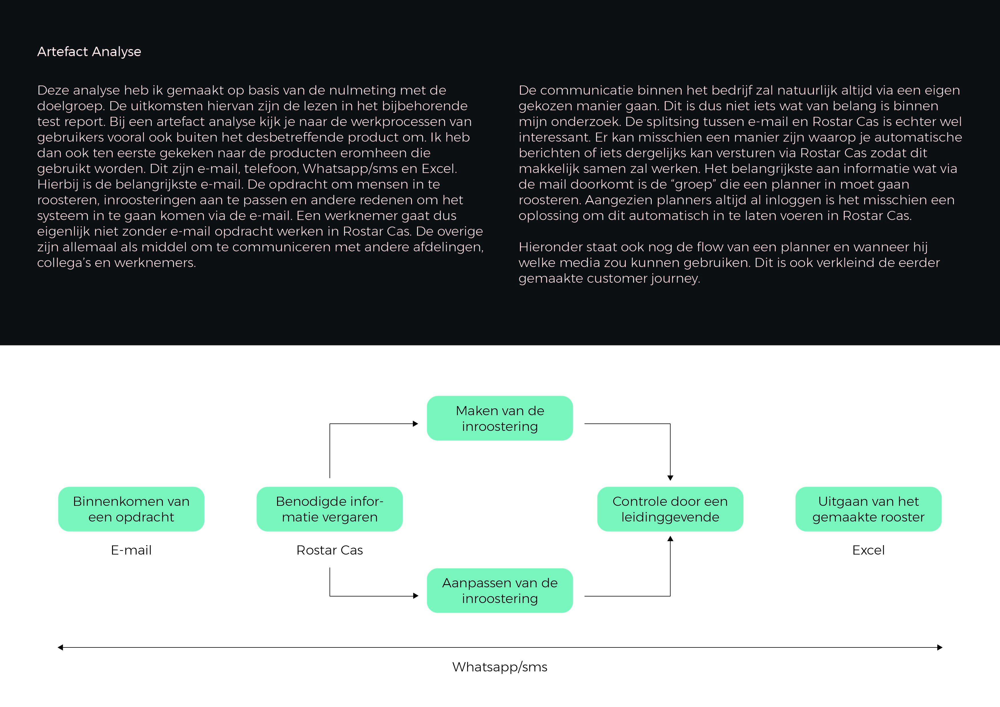

# Artefact Analyse

De Artefact Analyse wilde ik maken om te kijken wat planners nodig hebben naast Rostar Cas. Als dit namelijk een onderdeel is wat in mijn ontwerp al ingebouwd zit of als ik iets kan verbeteren waardoor het helemaal niet meer nodig is, is dat natuurlijk heel waardevol. De belangrijkste conclusie die ik hieruit heb kunnen trekken is het automatiseren van e-mail. Er wordt veel gemaild en dit moet nu volledig handmatig. Ik denk niet dat het voordelen heeft om een e-mail functie in te bouwen, maar je kan het wel makkelijker maken. Als je bijvoorbeeld de e-mailadressen links naar het mailprogramma op de computer maakt zou je met één klik je mail kunnen schrijven.

