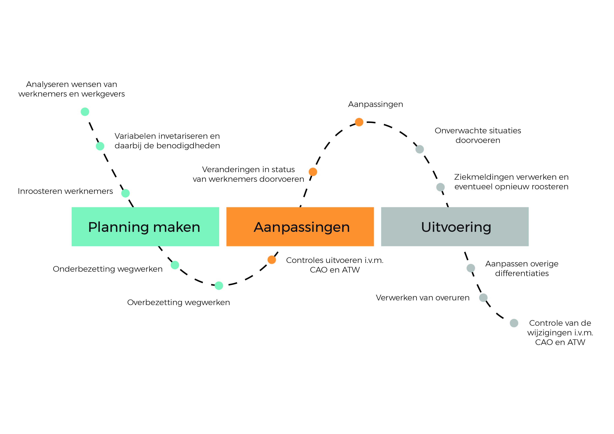
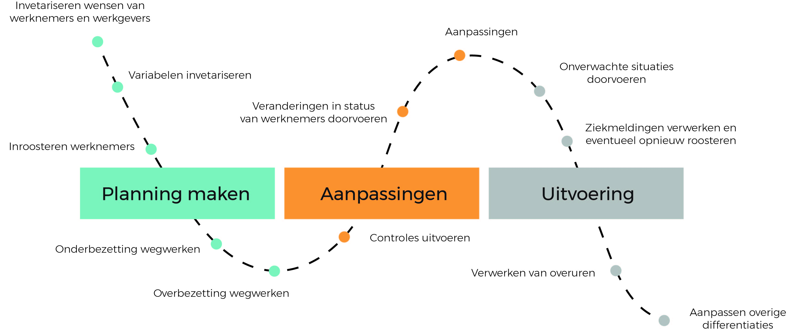

# Customer Journey

De Customer Journey is in een design proces belangrijk. Hiermee heb ik namelijk kunnen bepalen wanneer mijn gebruiker wat nodig heeft binnen de interface. Door de Customer Journey te maken, maak je inzichtelijk of deze wel logisch/makkelijk te doorlopen is. Ik heb naar aanleiding van deze Journey dan ook een aantal aanpassingen gemaakt, voornamelijk in de overgang tussen inroosteren en het aanpassen van het rooster.

