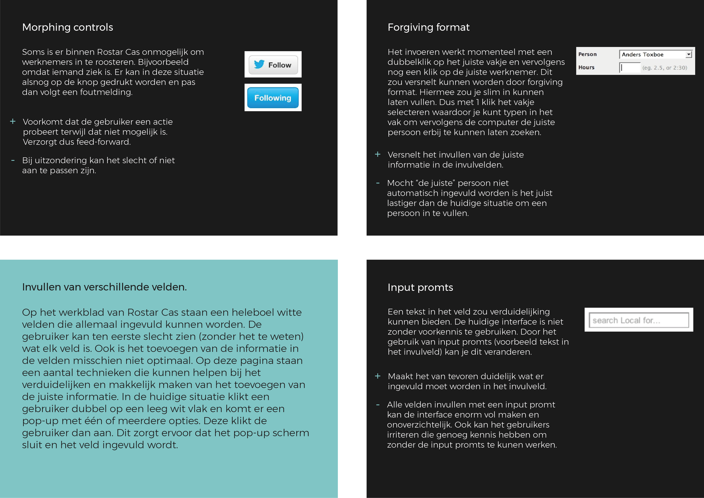

# Design Pattern Search

Aangezien ik een nieuw ontwerp ging maken vond ik het belangrijk om onderzoek te doen naar Design Pattern binnen het inroosteren van werknemers maar ook over het algemeen. Ik heb uiteindelijk gekozen om voor vier onderwerpen onderzoek te doen: mega menu's, iconen, invulvelden en searchfilters. Dit onderzoek heb ik het meest gebruikt tijdens het ontwerpen, maar deze is ook heel belangrijk bij het valideren van mijn keuzes. Waarom ik bijvoorbeeld voor een specifiek menu ben gegaan is gebaseerd hierop.

\*\*\*\*

