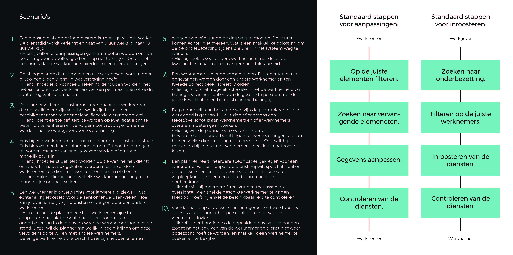
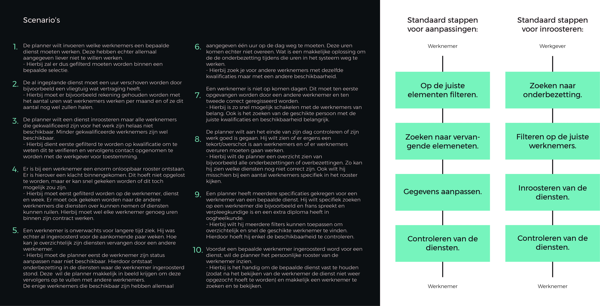

# Scenario's

Ik heb de scenario’s opgesteld om te gebruiken tijdens het ontwerpen, voor het testen van mijn concept en om het eindproduct te valideren. Ik heb hierbij gekeken welke acties er gemaakt worden en waarom. Ook is hierbij tijdlijn van belang. Zijn er acties met spoed bijvoorbeeld. De scenario’s heb ik eerste instantie samen met een planner opgesteld. Hierna heb ik deze nog gevalideerd bij mijn stagebegeleider.

