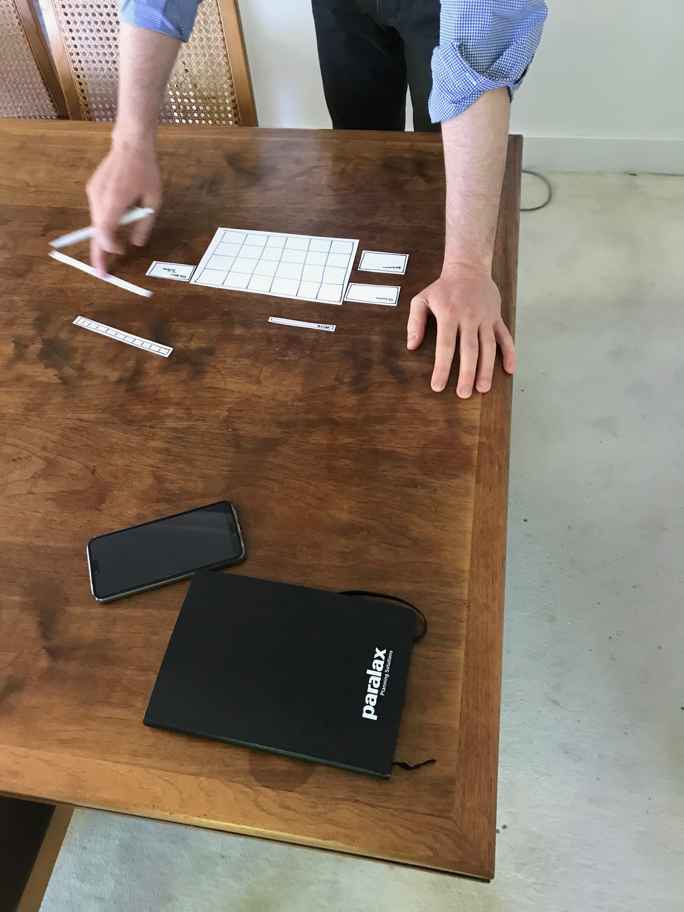

# Co-creatie

De Co-creatie is origineel met gebruikers en niet stakeholders. Ik vond echter dat er veel mensen binnen Paralax met ideeën over Rostar Cas rondliepen. Ik heb de Co-creatie gebruikt om deze ideeën bespreekbaar te maken. Eerst waren er niet veel mensen geïnteresseerd. Echter was dat anders toen ik eenmaal bezig was. Ik had een eerste persoon die als enige wilde helpen op dat moment en toen hij met de verschillende papiertjes stond te schuiven, bleven er vanzelf mensen plakken. De papiertjes waarmee hij stond te schuiven had ik van tevoren gemaakt. Dit waren de onderdelen die Rostar Cas zou moeten bevatten. Ik had wel een aantal extra’s gemaakt en ook een aantal verschillende opties voor bijvoorbeeld het menu. De Co-creatie was heel interessant aangezien ik heel veel ideeën heb gehoord. De verschillende manier van de kaartjes neerleggen heb ik echter niet kunnen gebruiken aangezien ik vlak daarna heb besloten om er een heel nieuw concept van te maken. De ideeën die ik verbaal gehoord heb, hebben echter wel aan deze keuze bijgedragen.

