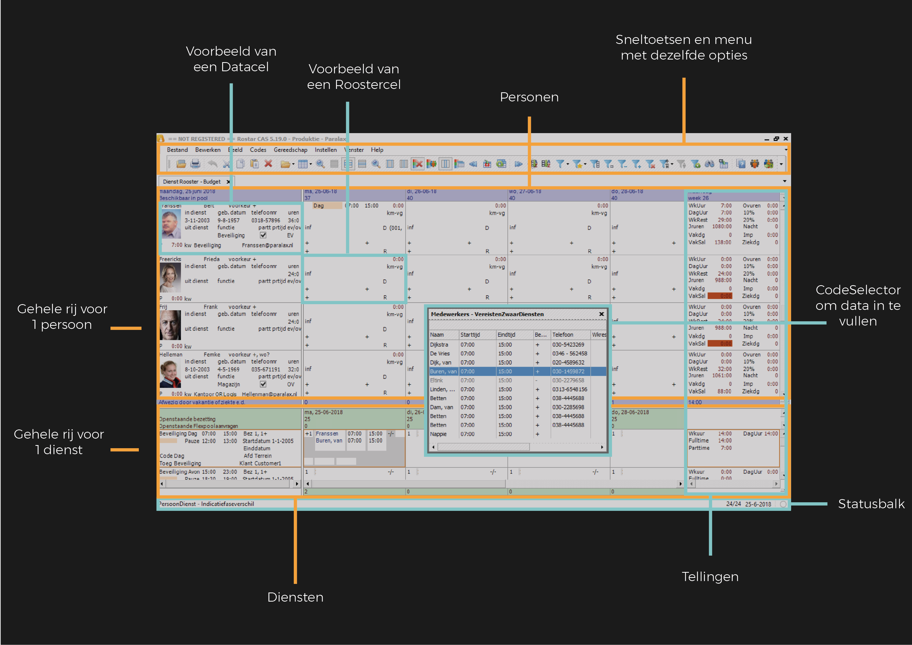

# Huidige situatie

Ik heb dit schema gemaakt om overzichtelijk te krijgen hoe de huidige situatie nu is. Dit was vrij makkelijk om te maken en heb ik ook niet echt meer gebruikt erna. Het was echt vooral om alles op een rijtje te krijgen.

