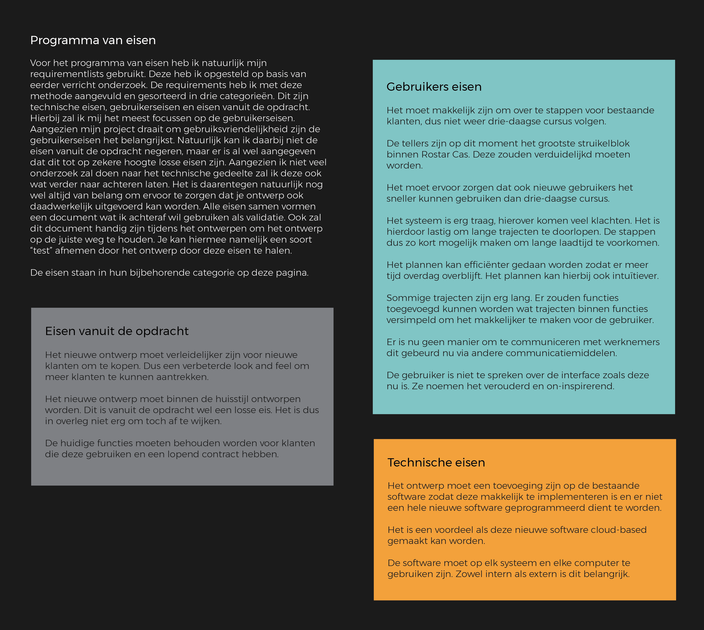

# Programma van Eisen

Het Programma van Eisen is een combinatie geworden van de User Requirement List en de Stakeholder Requirement List. Deze heb ik gesorteerd in categorieën en ik heb er nog een aantal eisen aan toegevoegd vanuit onderzoek. De eisen heb ik gebruikt tijdens het ontwerpen en als validatie van mijn uiteindelijke ontwerp.

