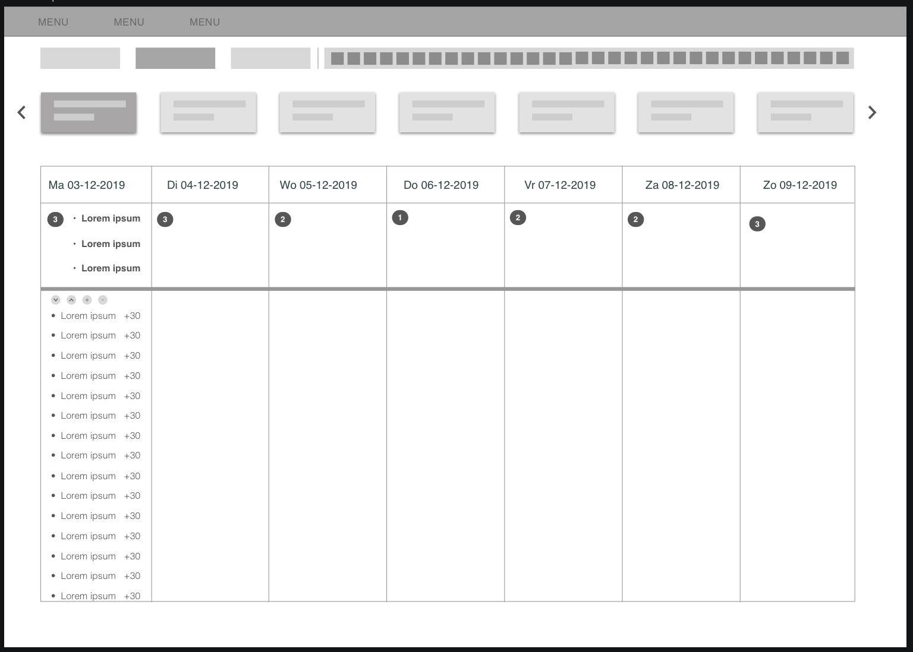
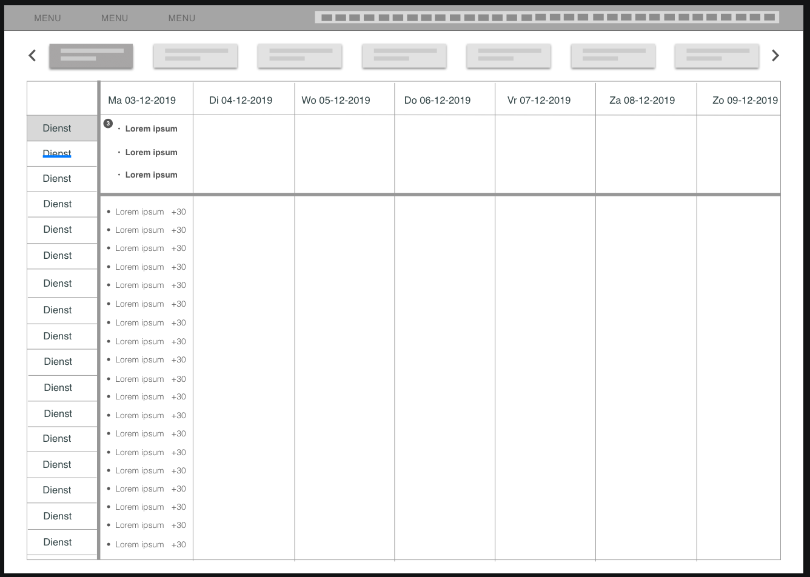

# 2 Combinaties

De laatste iteratie qua verschillende ontwerpen is hiermee gemaakt. Ik heb de belangrijkste inzichten van de feedback op de wireframes gecombineerd en kwam daarmee op onderstaande ontwerpen uit. Ik had al een vermoede dat de bovenste op deze pagina niet ging werken, maar om dat vast te stellen heb ik een kort prototype gemaakt \(hiernaast te vinden\). Echter maakte dit ontwerp het moeilijk om binnen diensten te kunnen zoek en sorteren. Dit is toch wel belangrijk voor een planner.

