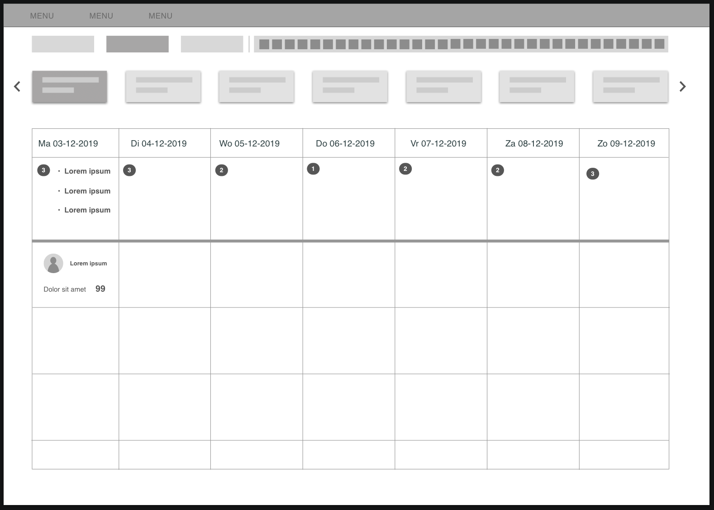
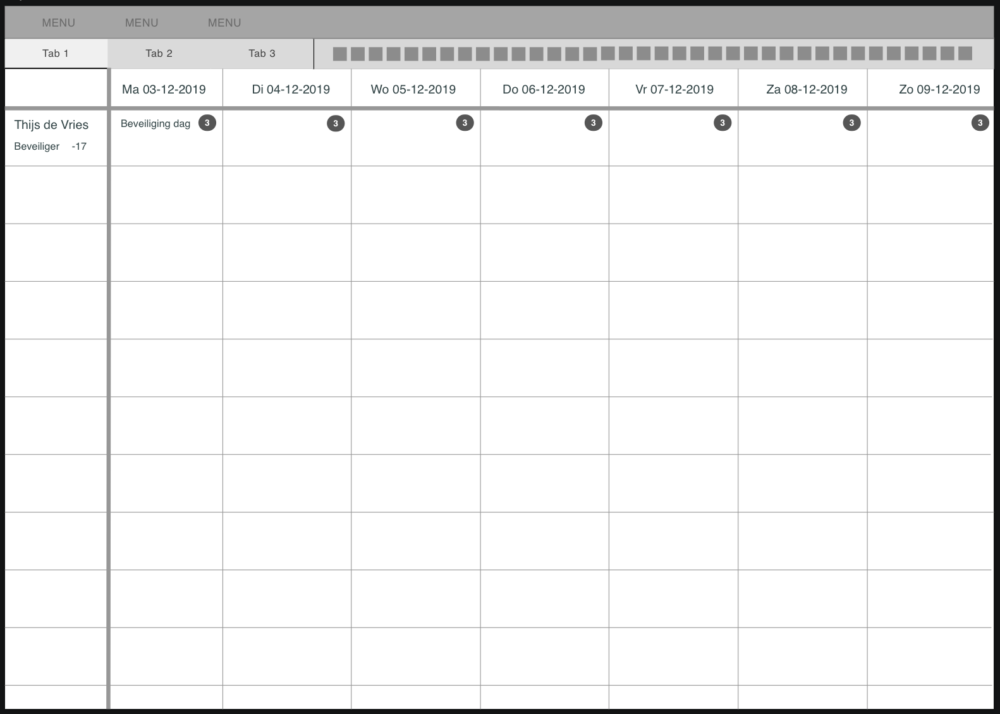
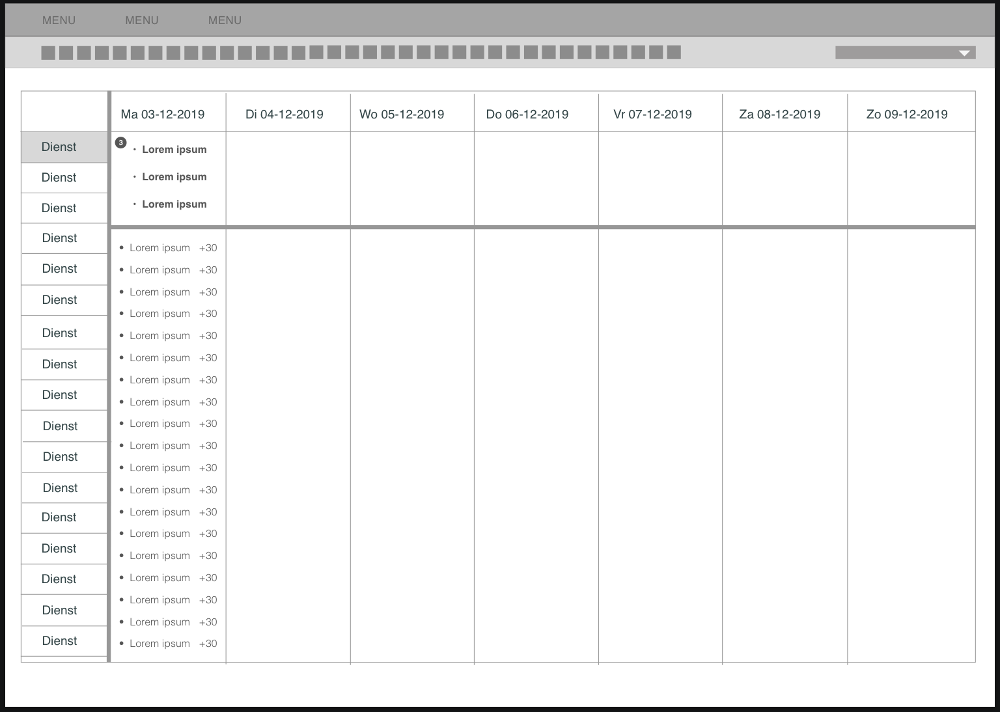
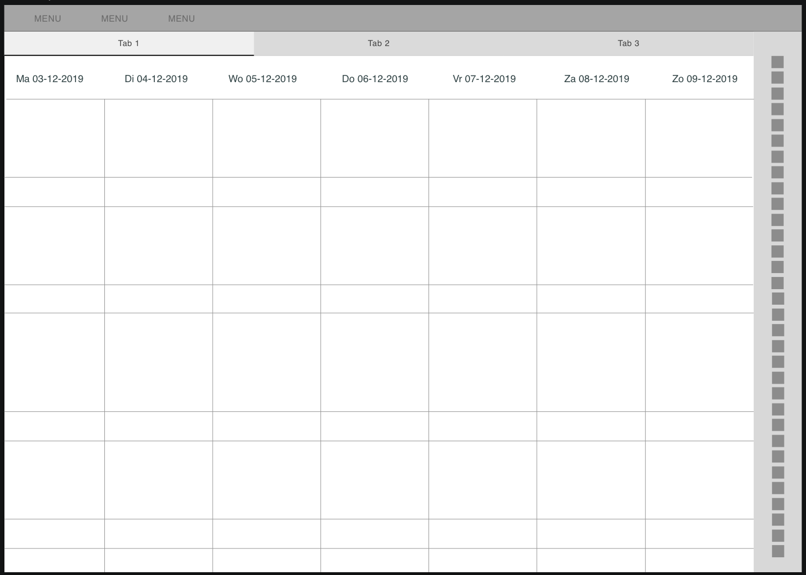

# 4 Digitale Wireframes

Ik vond het belangrijk dat de mensen met wie ik dit ging testen een goed en duidelijk beeld hadden van de opties zodat hun keuze niet beïnvloed werd door het niet begrijpen van een schets. Dit is namelijk belangrijk omdat mijn keuze voor het uiteindelijke ontwerp hiervan af zou hangen. Ik ben dit vervolgens gaan “testen” met twee planners die nu Rostar Cas gebruiken. Ik heb natuurlijk veel uit moeten leggen en vooral mijn concept. Aangezien ik alles heb omgegooid vergelijkend met het huidige ontwerp was het totaal niet te begrijpen zonder uitleg. Ik heb vervolgens dit ook voorgelegd aan Paralax en een aantal CMD’ers \(het testreport staat hiernaast "4 Digitale Wireframes". Hierdoor heb ik een goed gevarieerd beeld kunnen krijgen. Ik wist hierdoor dat ik nog een iteratie moest maken. Ik heb namelijk hierna nog twee combinaties gemaakt vanuit de wireframes. Een van deze is mijn uiteindelijke ontwerp geworden.

