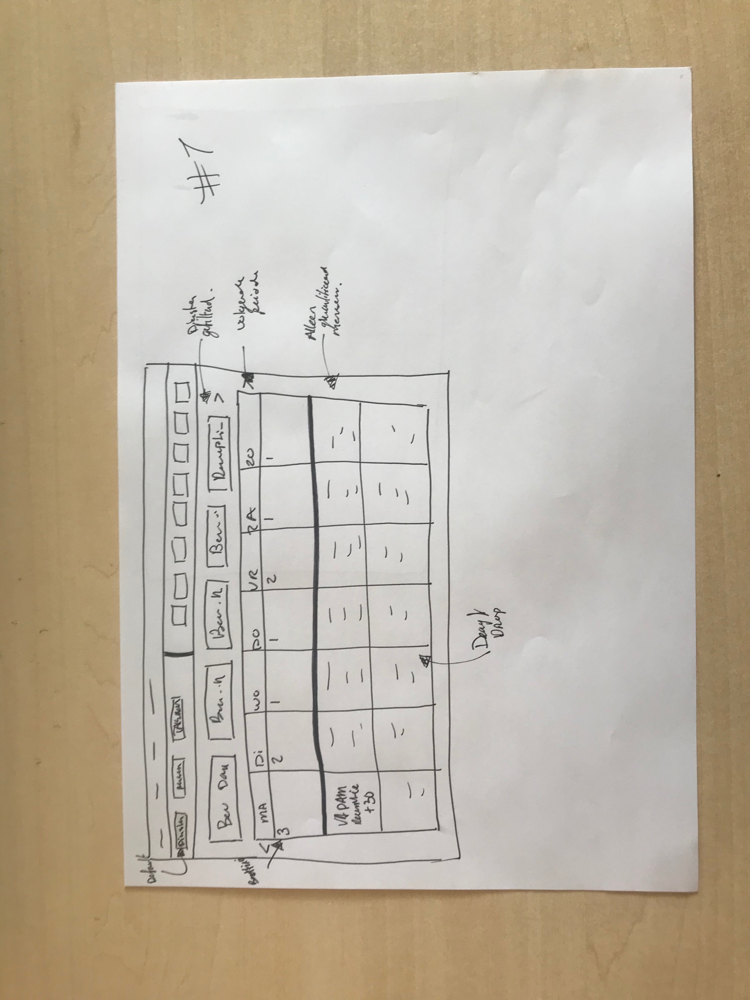
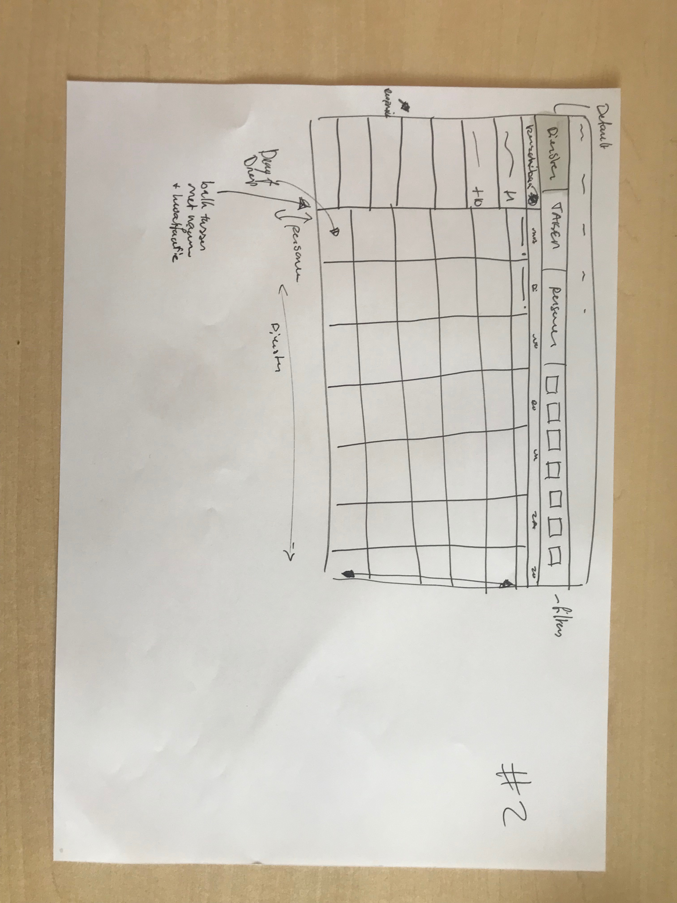
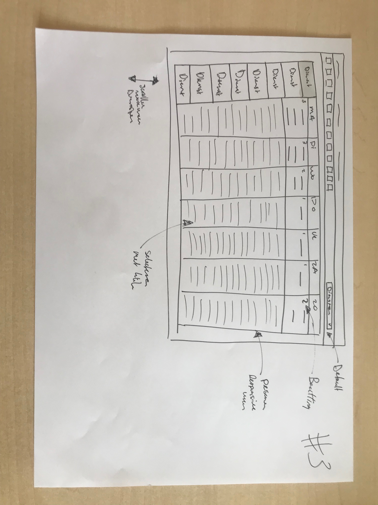
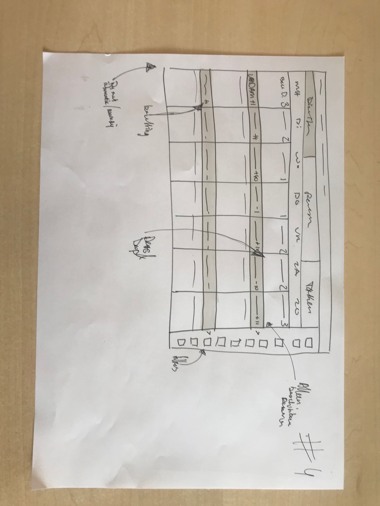
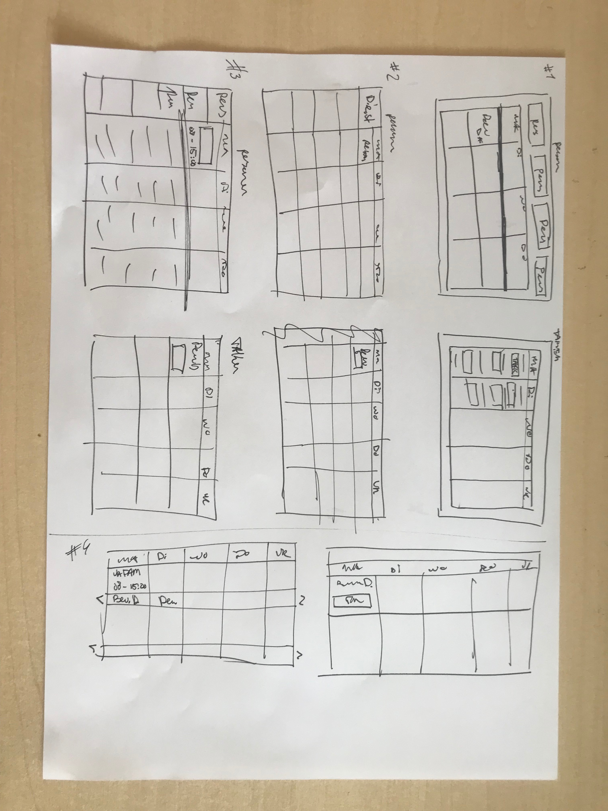

# 4 Wireframes

De schetsen ben ik gaan combineren. Zoals gezegd had ik een aantal elementen gevonden die wel zouden kunnen werken en een aantal die niet gingen werken. Ik heb deze mogelijk werkende elementen gecombineerd in een aantal wireframes. Dit zijn uiteindelijk mijn 4 opties geworden. Vanaf hier ben ik serieus gaan afwegen welke van deze opties mijn uiteindelijke ontwerp zou kunnen zijn. Om dit te kunnen doen heb ik echter besloten om deze direct digitaal uit te werken.

