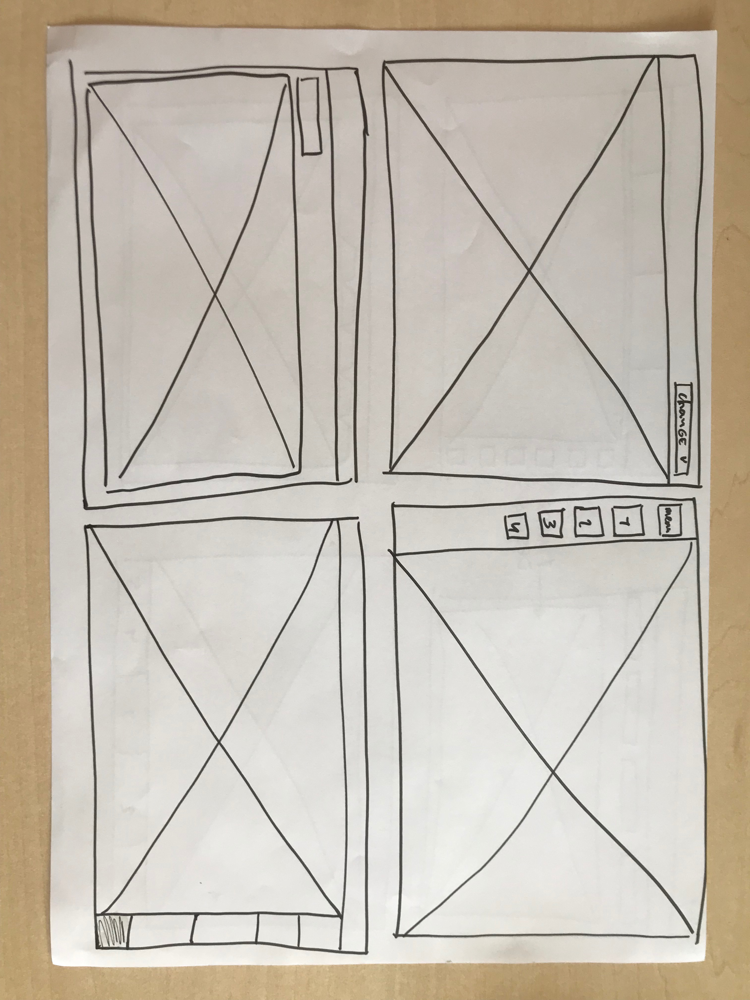
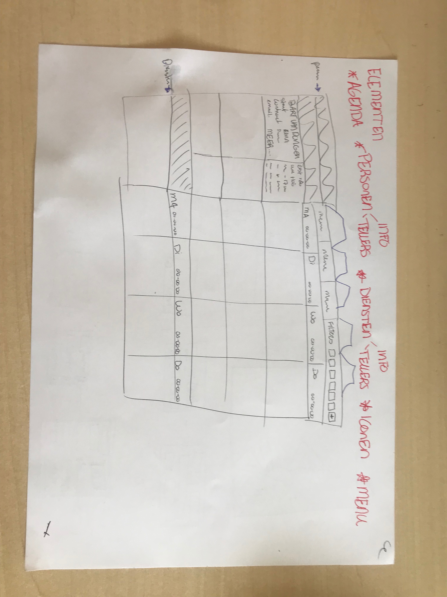

# Idee-ontwikkeling

Voordat ik met ideeontwikkeling begon heb ik de keuze gemaakt om opnieuw te beginnen qua onderdelen die op de interface komen. Ik heb hiervoor een aantal dingen geprobeerd met het behouden van de interface, maar dit was niet goed genoeg. Deze schetsen zijn dus gemaakt met alleen het idee dat het iets nieuws moet zijn. Er zijn natuurlijk wel een aantal elementen die nodig zijn voor een planner om in te kunnen roosteren, het bare-minimum,  met deze elementen ben ik aan de slag gegaan. Ik heb geprobeerd zo gevarieerd mogelijk te schetsen en door te gaan ook als ik dacht niets meer te weten. Ik heb uiteindelijk een deel van de schetsen gebruikt geschrapt omdat ze echt niet werkte een juist een aantal goede ideeën meegenomen naar de schetsen. Ik heb al deze schetsen voorgelegd aan een aantal mensen bij Paralax. Ook heb ik overlegt met het groepje afstudeerders en mijn docentbegeleider. Ik heb uiteindelijk op basis hiervan de volgende ronde schetsen gemaakt.

