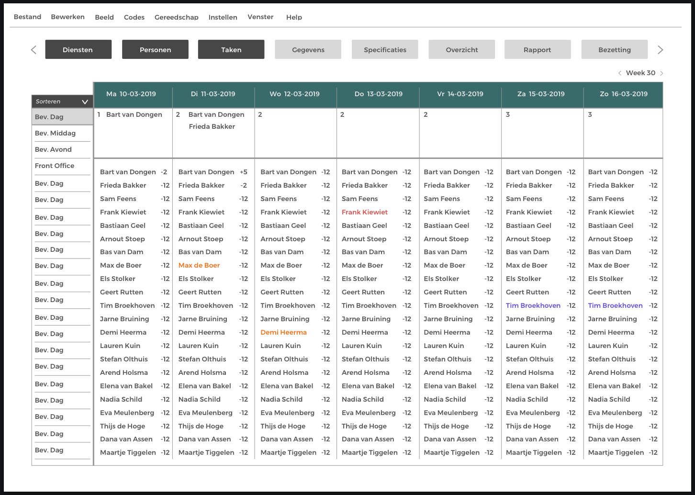
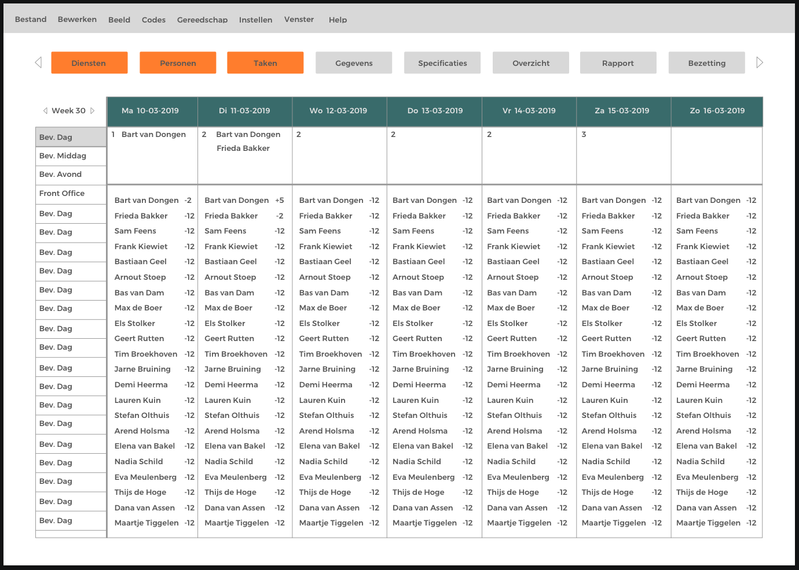

# Iteratie op de vormgeving

Toen ik de uiteindelijke indeling en elementen van mijn uiteindelijk ontwerp had ben ik aan de slag gegaan met vormgeving. Ik vond dit een belangrijke stap om gelijk te nemen. Hierdoor krijgen niet alleen ik maar ook de mensen die mij helpen in mijn project eindelijk een visie. Dit communiceert een stuk makkelijker en maakt het makkelijker feedback te krijgen. Nadat ik de eerste versie had gemaakt was ik gelijk ontevreden. Ik vond het niet mooi en de look and feel was niet waar ik naar streefde. Ik ben toen gelijk opnieuw begonnen en heb daardoor een tweede versie qua vormgeving.

