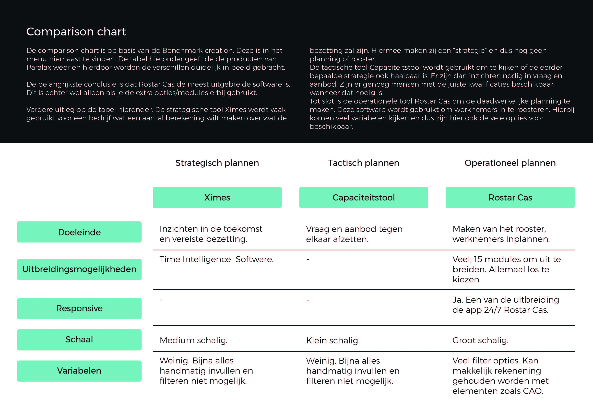

# Comparison Chart

Ik heb besloten om een Comparison Chart te maken omdat binnen Paralax er verschillende producten zijn en ik wist dat ik er maar aan eentje kon werken. Ik wilde dus goed kijken naar alle verschillen en voor- en nadelen. Hiermee wilde ik voorkomen dat ik oplossingen voor problemen in de tool waaraan ik heb gewerkt \(Rostar Cas\) zou gaan oplossen met nieuwe oplossingen terwijl deze al bestaan binnen het bedrijf. Verder vond ik het belangrijk om, ook op deze manier, een goed beeld te krijgen van Rostar Cas.

