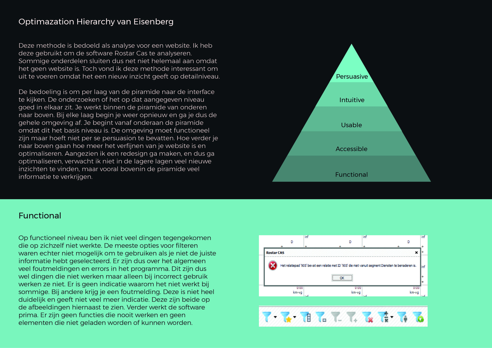
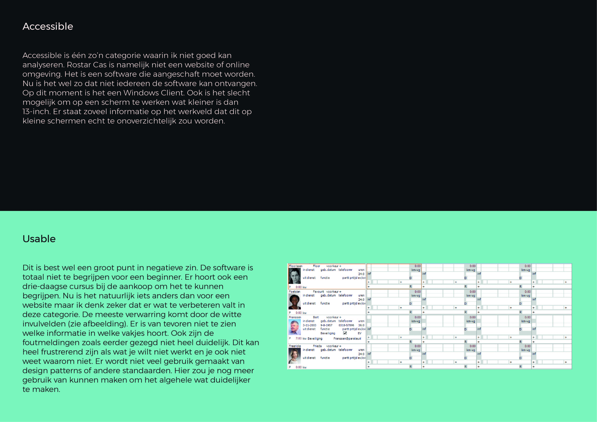
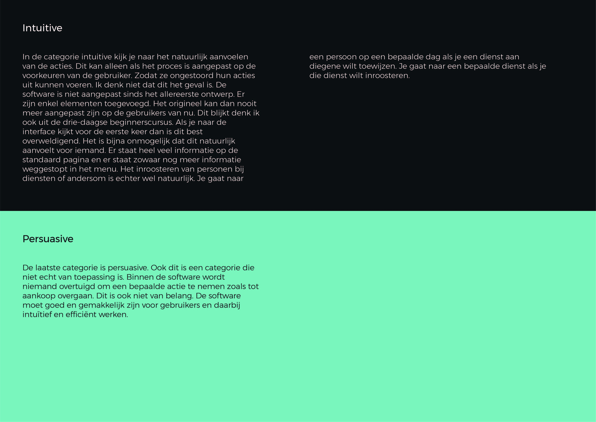

# Optimazation Hierarchy Eisenberg

De Optimazation Hierarchy is bedoel voor websites. Hierdoor heb ik hem niet helemaal kunnen doorlopen. Toch vond ik het belangrijk om deze methode te gebruiken. Als ik systematisch door een interface ga ontdek ik altijd veel meer punten die zowel positief als negatief kunnen zijn. Dit helpt mij om daadwerkelijk naar alles te kijken en eventuele problemen te prioriteren.  Ik heb hier achteraf best nog wel wat aan gehad. Ik heb vooral dingen gevonden niet negatief waren, maar deze waren juist handig om mee te nemen tijdens het ontwerpen.

