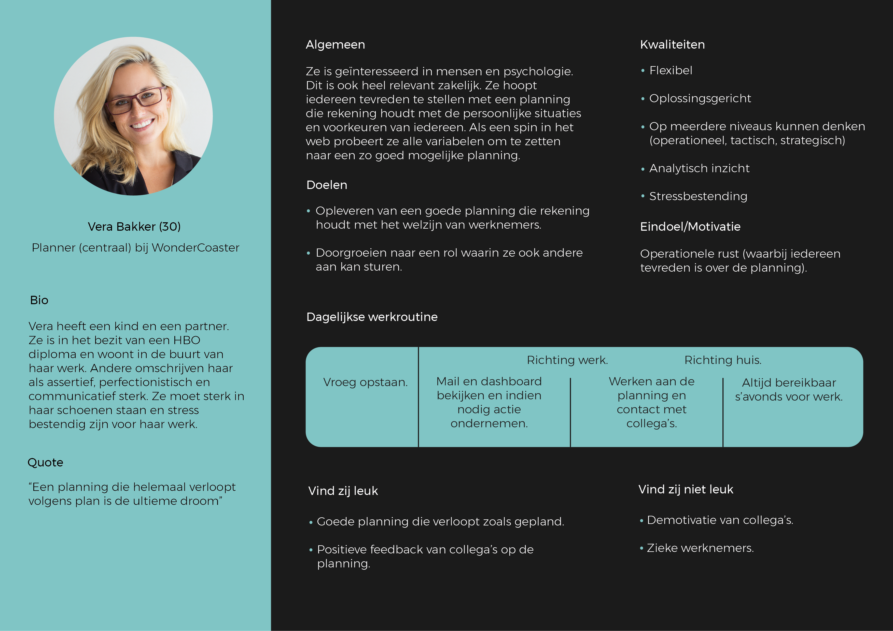

# Persona

De persona is een algemeen opgestelde persoon die de doelgroep representeerd. Er zijn dus altijd afwijkingen her en der, maar ik focus me erop om deze persona gelukkig te maken met mijn ontwerp. De persona is vooral belangrijk bij het ontwikkelen van het ontwerp. Ik heb deze dus vooral richting het einde van het project gebruikt. Ook heb ik deze kunnen gebruiken voor validatie achteraf. 

