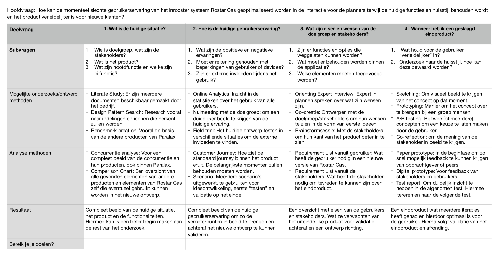

# Framework Hoofdvraag

De aanpassingen van het framework ging telkens op basis van feedback van de docentbegeleider. Deze feedback was de eerste paar keer op detailniveau, we zijn echter daarna erachter gekomen dat het redelijk omgegooid moest worden. Ik heb zelf ook een regel "subvragen" toegevoegd. Helemaal onderaan staat versie 4. Deze is later in het project gemaakt om het wat realistischer te maken. Ik ben namelijk her en der afgeweken van het framework en dit heb ik doorgevoerd in deze laatse versie. 

